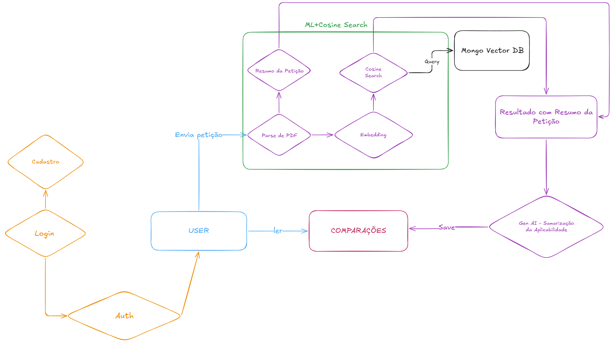
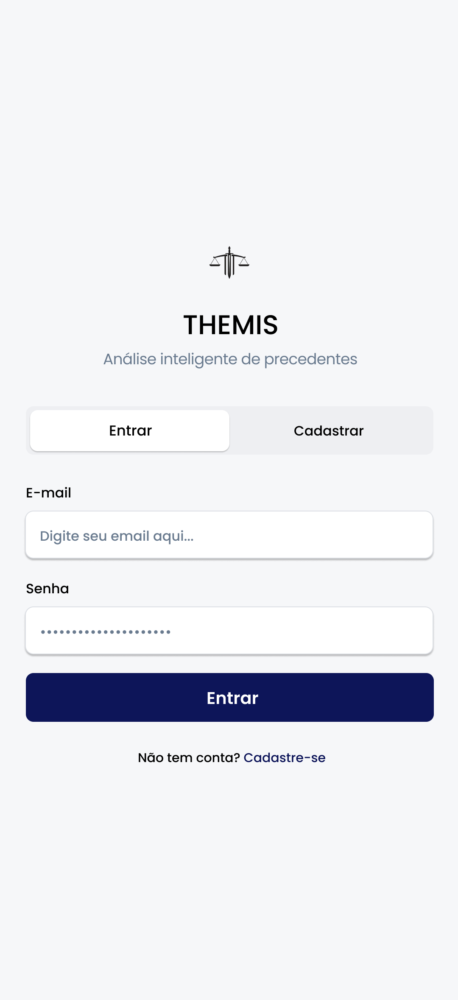
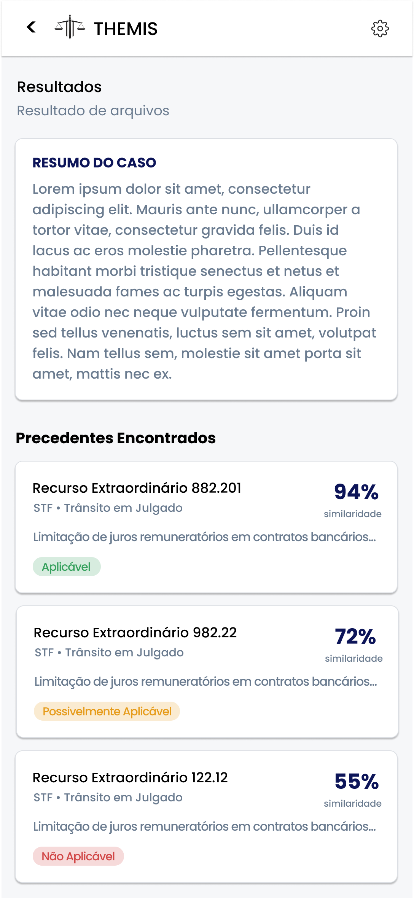

# FATEC Profº Jessen Vidal - São José dos Campos - 5º Semestre DSM - 2026

Projeto desenvolvido para a API (Aprendizagem por Projeto Integrado) do 5° Semestre do curso Desenvolvimento de Software Multiplataforma (DSM) em parceria com a Xertica.

> _A API se trata de um projeto submetido à metodologia de ensino em implantação na Fatec São José dos Campos, do qual os alunos formam equipes baseadas na metodologia ágil SCRUM, tendo um aluno como Scrum Master, um sendo o Product Owner e o restante dos integrantes como Dev Team._

---

### 📃 Repositórios
- [Repositório App](https://github.com/Equipe-Skyfall/themis-app)
- [Repositório BackEnd](https://github.com/Equipe-Skyfall/themis-back)
- [Repositório BD](https://github.com/Equipe-Skyfall/themis-db)

---

## 📑 Sumário
- [Visão do Projeto](#visao-do-projeto)
- [Dores do Cliente](#dores)
- [Cronograma do Projeto](#cronograma)
- [Tecnologias utilizadas](#tecnologias)
- [Padrões de Commit](#padrao)
- [Requisitos](#requisitos)
- [Arquitetura](#arquitetura)
- [Wireframes](#wireframes)
- [Definition of Ready (DoR)](#dor)
- [Definition of Done (DoD)](#dod)
- [Product Backlog](#backlog)
- [Sprint Backlog](#backsprint)
- [Links úteis](#links)
- [Equipe](#equipe)

---

## 🏥 Dores do Cliente 

### Verificar

Problemas relacionados à identificação e compreensão de precedentes jurídicos:

- Grande volume de decisões judiciais espalhadas entre diversos tribunais.
- Dificuldade em encontrar rapidamente precedentes realmente relevantes para um caso específico.
- Necessidade de ler diversas decisões completas para identificar informações importantes.
- Falta de uma análise automática que indique a similaridade entre casos.
- Ausência de um resumo objetivo que facilite a compreensão inicial do precedente.

### Planejar

Problemas relacionados ao planejamento de estratégias jurídicas:

- Dificuldade em identificar precedentes fortes para fundamentar petições.
- Tempo elevado gasto na pesquisa jurídica.
- Incerteza sobre quais decisões possuem maior probabilidade de aplicabilidade ao caso.
- Falta de ferramentas que ajudem a estruturar rapidamente argumentos jurídicos baseados em jurisprudência.
- Dificuldade em avaliar a relevância estratégica de um precedente para um processo.

### Controlar

Problemas relacionados à organização e gestão da informação jurídica:

- Falta de centralização das informações sobre precedentes.
- Dificuldade em acompanhar o status atual de decisões judiciais (vigência, trânsito em julgado, etc.).
- Falta de indicadores claros que ajudem a priorizar precedentes mais relevantes.
- Falta de ferramentas que organizem automaticamente as informações jurídicas encontradas.
- Risco de utilizar precedentes inadequados ou pouco relevantes por falta de análise sistemática.

---

## 👁 Visão do Projeto 

Nosso projeto consiste em uma plataforma inteligente de análise jurídica em nuvem que utiliza aprendizado de máquina e processamento de linguagem natural para analisar petições iniciais e identificar precedentes judiciais relevantes. O sistema gera um resumo do caso, consulta bases nacionais de precedentes e apresenta decisões potencialmente aplicáveis com informações estruturadas, percentual de similaridade e classificação de aplicabilidade. A solução será acessada por meio de um aplicativo móvel com interface intuitiva, auxiliando profissionais do Direito a encontrar precedentes relevantes com mais rapidez e precisão.

---

## Cronograma de Sprints 

| Sprint | Período | Status | Relatório |
|:------:|:-------:|:------:|:---------:|
| 1 | 16/03/2026 à 05/04/2026 | Não Concluído | [Ver Relatório](https://github.com/Equipe-Skyfall/skytrack/blob/main/docs/Sprint%201) |
| 2 | 13/04/2026 à 03/05/2026 | Não Concluído | [Ver Relatório](https://github.com/Equipe-Skyfall/skytrack/blob/main/docs/Sprint%202) |
| 3 | 11/05/2026 à 31/05/2026 | Não Concluído | [Ver Relatório](https://github.com/Equipe-Skyfall/skytrack/tree/main/docs/Sprint%203) |

---

## 💻 Tecnologias utilizadas 

| Tecnologia | Finalidade |
|:----------:|------------|
|  | Desenvolvimento do aplicativo mobile (iOS e Android) |
|  | Processamento de linguagem natural e lógica de análise jurídica |
|  | API REST para comunicação entre o app e o backend |
|  | Banco de dados para armazenamento de petições, precedentes e histórico |
|  | Design de interfaces e prototipação dos wireframes |
|  | Empacotamento e orquestração da aplicação via containers (Docker Swarm) |

---

### 📃 Estrutura de Branches
- **Main** — Estado principal que armazena a versão estável do projeto
- **Dev** — Estado de desenvolvimento atual

### ⏳ Status do projeto: 0/3 Sprints

---

## 💻 Padrões de Commit 

**FEAT**: Adiciona um novo recurso ou funcionalidade.
> Exemplo: `FEAT - Adição da navbar`

**FIX**: Corrige um bug.
> Exemplo: `FIX - Corrige o modal que não estava fechando`

**CHORE**: Atualizações de manutenção que não alteram a lógica de negócio ou visual.
> Exemplo: `CHORE - Atualização das dependências do Node.js`

**DOCS**: Altera a documentação.
> Exemplo: `DOCS - Atualiza README com informações sobre novas rotas`

**STYLE**: Modifica a formatação do código sem alterar a lógica.
> Exemplo: `STYLE - Adiciona comentários no código para facilitar a leitura`

**REFACTOR**: Refatora o código sem adicionar funcionalidades ou corrigir bugs.
> Exemplo: `REFACTOR - Refatora o código, deixando-o mais leve`

**TEST**: Adiciona, modifica ou remove testes.
> Exemplo: `TEST - Adiciona teste para o componente de login`

**PERF**: Melhora a performance.
> Exemplo: `PERF - Otimiza a execução de consultas no banco de dados`

**BUILD**: Altera o sistema de build ou dependências externas.
> Exemplo: `BUILD - Adiciona um Dockerfile para o ambiente de produção`

**REVERT**: Reverte um commit anterior.
> Exemplo: `REVERT - Reverte a adição de autenticação de middleware`

**HOTFIX**: Corrige um bug crítico em produção de forma urgente.
> Exemplo: `HOTFIX - Corrige vulnerabilidade crítica na autenticação de usuários`

> **Nomenclatura de variáveis:** padrão `camelCase` (ex: `nomeCompleto`).

---

## 📋 Requisitos 

### Requisitos Funcionais

| RF | Nome | Descritivo |
|----|------|------------|
| RF1 | Upload de petição inicial | O sistema deve permitir que o usuário envie uma petição inicial em formato PDF para análise automática. |
| RF2 | Processamento do texto | O sistema deve analisar automaticamente o conteúdo textual da petição para identificar as informações jurídicas relevantes. |
| RF3 | Consulta à base de precedentes | O sistema deve consultar automaticamente a base própria de precedentes jurídicos já indexada para identificar decisões relacionadas ao caso analisado. |
| RF4 | Identificação de precedentes relacionados | O sistema deve identificar os precedentes mais relacionados ao caso com base no conteúdo da petição enviada. |
| RF5 | Classificação de aplicabilidade | O sistema deve calcular a similaridade entre a petição e cada precedente encontrado e classificá-los como "Aplicável", "Possivelmente aplicável" ou "Não aplicável". |
| RF6 | Exibição de dados estruturados | O sistema deve apresentar as informações de cada precedente, incluindo tribunal de origem, tema, enunciado, status e tese firmada quando disponível. |
| RF7 | Síntese explicativa | O sistema deve gerar uma explicação resumida que indique a relação entre o precedente identificado e o caso analisado. |
| RF8 | Geração de resumo | O sistema deve gerar um resumo automático da petição e apresentá-lo na tela de resultados, destacando as principais informações do caso. |
 

### Requisitos Não Funcionais

| RNF | Nome | Descritivo |
|-----|------|------------|
| RNF1 | Manual de Instalação | Documentação de instalação disponível no repositório do projeto. |
| RNF2 | Manual do Usuário | Documentação orientada ao usuário final explicando como utilizar as funcionalidades do sistema. |
| RNF3 | Documentação de APIs | Elaboração detalhada da documentação para todas as rotas da API, incluindo exemplos de uso. |
| RNF4 | Integração Contínua (CI) | Implementação de um processo automático de testes e validações a cada atualização do sistema. |
| RNF5 | Ambiente de Execução | A aplicação deve ser empacotada com Docker e disponibilizada via Swarm para facilitar a execução e a publicação do sistema. |

---

## 🏗 Arquitetura 

---

## 🖥 Wireframes 

<table>
  <tr>
    <td align="center" valign="top"><strong>Página Principal</strong> </td>
    <td align="center" valign="top"><strong>Cadastro</strong> </td>
    <td align="center" valign="top"><strong>Nova Análise</strong> </td>
  </tr>
  <tr>
    <td align="center" valign="top"><strong>Resultados</strong> </td>
    <td align="center" valign="top"><strong>Resultado (Modal)</strong> </td>
    <td align="center" valign="top"><strong>Página do Usuário</strong> </td>
  </tr>
</table>

---

## ✅ Definition of Ready (DoR) 

- [x] **User Stories completas:** Todos os requisitos descritos em User Stories planejadas para caber na sprint.
- [x] **Tarefas detalhadas e atribuídas:** Cada User Story deve ter ao menos uma task detalhada e atribuída a um responsável.
- [x] **Critérios de aceitação definidos:** Cada User Story deve ter critérios de aceitação bem estabelecidos.
- [x] **Estimativas definidas:** Todas as User Stories devem ter uma estimativa de esforço/tamanho feita pelo time.
- [x] **Wireframe/Mockup aprovados:** O cliente deve ter validado e aprovado os protótipos visuais.
- [x] **Modelo de dados finalizado:** Estrutura de dados completamente definida e documentada.
- [x] **Ambiente de desenvolvimento pronto:** O time deve ter acesso a todos os ambientes, ferramentas e permissões necessárias.

---

## ✅ Definition of Done (DoD) 

- [ ] **Critérios de aceitação validados:** Todos os critérios de aceitação foram atendidos e verificados com testes apropriados.
- [ ] **Execução de testes adequados:** Testes unitários, de integração e de aceitação foram realizados para garantir a estabilidade e funcionamento correto da aplicação.
- [ ] **Commits organizados e documentados:** Os commits seguem a nomenclatura acordada, são claros, segmentados e possuem histórico bem documentado.
- [ ] **Guia de instalação detalhado:** A documentação de instalação é clara e completa, permitindo que qualquer usuário ou desenvolvedor configure e execute a aplicação sem dificuldades.
- [ ] **Manual do usuário disponível:** Um manual foi criado para orientar o cliente sobre o funcionamento da aplicação.

---
## 📜 Product Backlog 

| RANK | SPRINT | PRIORIDADE | ESTIMATIVA | USER STORY | RF | STATUS |
|:----:|:------:|:----------:|:----------:|------------|----|:------:|
| 1 | 1 | Alta | 5 | Como juiz, quero enviar uma petição inicial em PDF pelo aplicativo, para que o sistema possa analisá-la automaticamente. | RF1 | 🔲 |
| 2 | 1 | Alta | 8 | Como juiz, quero que o sistema identifique automaticamente as informações jurídicas relevantes da petição enviada, para que os precedentes encontrados sejam precisos. | RF2 | 🔲 |
| 3 | 1 | Alta | 8 | Como juiz, quero visualizar uma lista de precedentes da base jurídica relacionados ao caso, para que eu identifique rapidamente as decisões mais próximas. | RF3, RF4 | 🔲 |
| 4 | 1 | Alta | 5 | Como juiz, quero ver a classificação de aplicabilidade de cada precedente — Aplicável, Possivelmente aplicável ou Não aplicável —, para que eu saiba quais merecem atenção prioritária. | RF5 | 🔲 |
| 5 | 1 | Alta | 3 | Como juiz, quero ver o percentual de similaridade de cada precedente em relação ao caso, para que eu compreenda o grau de proximidade entre as decisões. | RF5 | 🔲 |
| 6 | 1 | Alta | 5 | Como juiz, quero visualizar as informações detalhadas de cada precedente — tribunal, tema, enunciado e status —, para que eu avalie sua aplicabilidade com precisão. | RF6 | 🔲 |
| 7 | 1 | Alta | 3 | Como juiz, quero que a tese firmada de um precedente seja exibida quando disponível, para que eu tenha acesso à posição consolidada sobre o tema. | RF6 | 🔲 |
| 8 | 2 | Média | 8 | Como juiz, quero que o sistema gere automaticamente um resumo da petição recebida, para que eu compreenda os pontos centrais do caso sem precisar ler o documento completo. | RF8 | 🔲 |
| 9 | 2 | Média | 8 | Como juiz, quero ler uma explicação sobre por que cada precedente se relaciona ao caso analisado, para que eu compreenda a conexão jurídica sem pesquisa adicional. | RF7 | 🔲 |
| 10 | 3 | Baixa | 5 | Como juiz, quero acessar o histórico das petições que já analisei, para que eu revise resultados anteriores sem precisar enviar o documento novamente. | — | 🔲 |
| 11 | 3 | Baixa | 5 | Como juiz, quero exportar o relatório de análise em PDF, para que eu arquive ou compartilhe os resultados com outros membros do processo. | — | 🔲 |

---

## 📝 Sprint Backlog 

<strong>Sprint 1 — Upload, Processamento e Comparação de Precedentes</strong>

 

> **Período:** 16/03/2026 à 05/04/2026
> **Foco:** Estrutura base do sistema — o juiz envia a petição, o sistema identifica informações jurídicas relevantes, consulta a base de precedentes e retorna os resultados com classificação de aplicabilidade.

| RANK | PRIORIDADE | ESTIMATIVA | USER STORY | RF | STATUS |
|:----:|:----------:|:----------:|------------|----|:------:|
| 1 | Alta | 5 | Como juiz, quero enviar uma petição inicial em PDF pelo aplicativo, para que o sistema possa analisá-la automaticamente. | RF1 | ✅ |
| 2 | Alta | 8 | Como juiz, quero que o sistema identifique automaticamente as informações jurídicas relevantes da petição enviada, para que os precedentes encontrados sejam precisos. | RF2 | ✅ |
| 3 | Alta | 8 | Como juiz, quero visualizar uma lista de precedentes da base jurídica relacionados ao caso, para que eu identifique rapidamente as decisões mais próximas. | RF3, RF4 | ✅ |
| 4 | Alta | 5 | Como juiz, quero ver a classificação de aplicabilidade de cada precedente — Aplicável, Possivelmente aplicável ou Não aplicável —, para que eu saiba quais merecem atenção prioritária. | RF5 | ✅ |

---

US01 — Envio de petição inicial em PDF

**Critérios de Aceitação**
- [x] O sistema deve aceitar arquivos exclusivamente no formato PDF.
- [x] O envio deve ser confirmado visualmente ao usuário após o upload.
- [x] Arquivos inválidos ou corrompidos devem exibir mensagem de erro clara.

US02 — Identificação automática de informações jurídicas

**Critérios de Aceitação**
- [x] O sistema deve extrair automaticamente as informações jurídicas relevantes da petição enviada.
- [x] As informações extraídas devem ser utilizadas como base para a consulta à base de precedentes.
- [x] O processamento deve ocorrer sem necessidade de intervenção manual do usuário.

US03 — Visualização de lista de precedentes relacionados

**Critérios de Aceitação**
- [x] O sistema deve retornar ao menos um precedente relacionado ao conteúdo da petição.
- [x] Os precedentes devem ser exibidos em lista ordenada por grau de relevância.
- [x] Cada item da lista deve apresentar informações básicas de identificação do precedente.

US04 — Classificação de aplicabilidade dos precedentes

**Critérios de Aceitação**
- [x] Cada precedente deve ser classificado como "Aplicável", "Possivelmente aplicável" ou "Não aplicável".
- [x] A classificação deve ser visualmente distinta para cada categoria.
- [x] A lógica de classificação deve ser baseada no percentual de similaridade calculado.

---

<strong>Sprint 2 — Resumo e Síntese Explicativa</strong>

 

> **Período:** 13/04/2026 à 03/05/2026
> **Foco:** Geração automática de resumo da petição e síntese explicativa por precedente.

| RANK | PRIORIDADE | ESTIMATIVA | USER STORY | RF | STATUS |
|:----:|:----------:|:----------:|------------|----|:------:|
| 5 | Alta | 3 | Como juiz, quero ver o percentual de similaridade de cada precedente em relação ao caso, para que eu compreenda o grau de proximidade entre as decisões. | RF5 | 🔲 |
| 6 | Alta | 5 | Como juiz, quero visualizar as informações detalhadas de cada precedente — tribunal, tema, enunciado e status —, para que eu avalie sua aplicabilidade com precisão. | RF6 | 🔲 |
| 7 | Alta | 3 | Como juiz, quero que a tese firmada de um precedente seja exibida quando disponível, para que eu tenha acesso à posição consolidada sobre o tema. | RF6 | 🔲 |
| 8 | Média | 8 | Como juiz, quero que o sistema gere automaticamente um resumo da petição recebida, para que eu compreenda os pontos centrais do caso sem precisar ler o documento completo. | RF8 | 🔲 |

---

US05 — Percentual de similaridade por precedente

**Critérios de Aceitação**
- [ ] O percentual de similaridade deve ser calculado e exibido para cada precedente listado.
- [ ] O valor deve ser apresentado em formato numérico percentual (ex.: 87%).
- [ ] O cálculo deve ser coerente com o conteúdo da petição enviada.

US06 — Informações detalhadas do precedente

**Critérios de Aceitação**
- [ ] Os campos tribunal, tema, enunciado e status devem ser exibidos para cada precedente.
- [ ] Campos indisponíveis na base de dados devem ser sinalizados como "Não disponível".
- [ ] As informações devem ser apresentadas de forma estruturada e legível.

US07 — Exibição da tese firmada quando disponível

**Critérios de Aceitação**
- [ ] A tese firmada deve ser exibida quando disponível na base de dados do precedente.
- [ ] O campo deve ser omitido ou sinalizado como indisponível quando ausente.
- [ ] A exibição deve ser visualmente diferenciada dos demais campos do precedente.

US08 — Resumo automático da petição

**Critérios de Aceitação**
- [ ] O sistema deve gerar automaticamente um resumo a partir do conteúdo da petição enviada.
- [ ] O resumo deve ser exibido na tela de resultados antes da lista de precedentes.
- [ ] O conteúdo do resumo deve refletir os pontos centrais identificados na petição.

---

<strong>Sprint 3 — Histórico e Exportação</strong>

 

> **Período:** 11/05/2026 à 31/05/2026
> **Foco:** Completar a experiência do usuário com histórico de análises e exportação de relatórios.

| RANK | PRIORIDADE | ESTIMATIVA | USER STORY | RF | STATUS |
|:----:|:----------:|:----------:|------------|----|:------:|
| 9 | Média | 8 | Como juiz, quero ler uma explicação sobre por que cada precedente se relaciona ao caso analisado, para que eu compreenda a conexão jurídica sem pesquisa adicional. | RF7 | 🔲 |
| 10 | Baixa | 5 | Como juiz, quero acessar o histórico das petições que já analisei, para que eu revise resultados anteriores sem precisar enviar o documento novamente. | — | 🔲 |
| 11 | Baixa | 5 | Como juiz, quero exportar o relatório de análise em PDF, para que eu arquive ou compartilhe os resultados com outros membros do processo. | — | 🔲 |

---

US09 — Síntese explicativa por precedente

**Critérios de Aceitação**
- [ ] O sistema deve gerar uma explicação individual para cada precedente retornado.
- [ ] A explicação deve indicar a relação entre o precedente e o caso analisado.
- [ ] O conteúdo deve ser exibido de forma acessível junto ao respectivo precedente.

US10 — Histórico de petições analisadas

**Critérios de Aceitação**
- [ ] O histórico deve listar todas as petições analisadas pelo usuário com data e nome do arquivo.
- [ ] Cada entrada deve permitir acesso aos resultados da análise correspondente.
- [ ] Os dados devem persistir entre sessões do usuário.

US11 — Exportação do relatório em PDF

**Critérios de Aceitação**
- [ ] O relatório deve ser exportado em PDF contendo resumo, precedentes e classificações.
- [ ] O download deve ser iniciado diretamente pela tela de resultados.
- [ ] O arquivo gerado deve estar formatado de forma legível e organizada.

---
## Links Úteis 

- [Base de Precedentes Pangea](https://pangeabnp.pdpj.jus.br/)
- [O que é um precedente jurídico?](https://www.jusbrasil.com.br/artigos/afinal-o-que-e-um-precedente/1889550599)

---

## 👥 Equipe 

| Foto | Função | Nome | LinkedIn | GitHub |
|:----:|:------:|:----:|:--------:|:------:|
|  | Dev Team | Eduardo da Silva Fontes | [LinkedIn](https://www.linkedin.com/in/eduardo-da-silva-fontes/) | [GitHub](https://github.com/DuuhZero) |
|  | Dev Team | Eduardo Kuwahara Jr. | [LinkedIn](https://www.linkedin.com/in/eduardo-kuwahara-3b2267303/) | [GitHub](https://github.com/EduardoKuwahara) |
|  | Dev Team | Eric Kawata | [LinkedIn](https://www.linkedin.com/in/eric-kawata-99678b302/) | [GitHub](https://github.com/ericFatec) |
|  | Dev Team | Fábio Hiroshi | [LinkedIn](https://www.linkedin.com/in/f%C3%A1bio-hiroshi-5393a51a0) | [GitHub](https://github.com/FabioHiros) |
|  | Dev Team | João Vitor Rossi Ferreira | [LinkedIn](https://www.linkedin.com/in/joão-rossi-7311a0301/) | [GitHub](https://github.com/joaorossiferreira) |
|  | Dev Team | Kathellyn Caroline Alves dos Santos | [LinkedIn](https://www.linkedin.com/in/kathellyn-caroline-a562101b9) | [GitHub](https://github.com/CarolineKathellyn) |
|  | Product Owner | Victor Daniel |  [Linkedin](https://www.linkedin.com/in/victor-daniel-ramos-bessa-1436a3215/)  | [GitHub](https://github.com/victordanielrb)    |
|  | Scrum Master | Paulo Henrique Martins de Almeida | [LinkedIn](https://www.linkedin.com/in/paulo-almeida-3102452a7/) | [GitHub](https://github.com/pauloalmeida46) |
